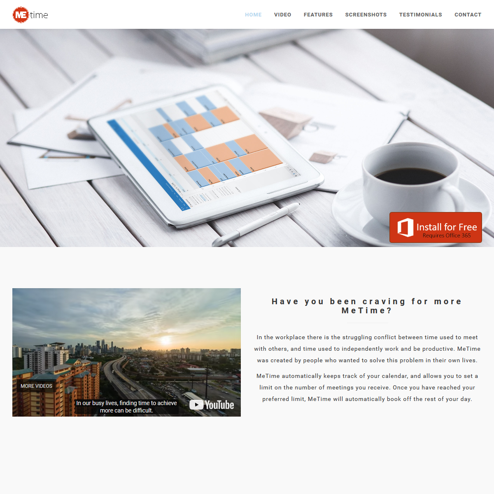

# MeTime

MeTime is a 2017 Microsoft Hackathon project with the goal to reduce the number of hours you spend in meetings during your workday.

MeTime allows you to set a maximum number of hours of meetings you want per day. Then, it uses the Office 365 Calendar APIs to passively watch your daily meetings, and automatically block off the rest of your day when you pass your meeting threshold.

To others, it appears that your whole day is full of other meetings, but you can see that MeTime has booked you free time to get work done.

Unfortunately, MeTime is NOT an open source project, so the code here is just the product page we created.